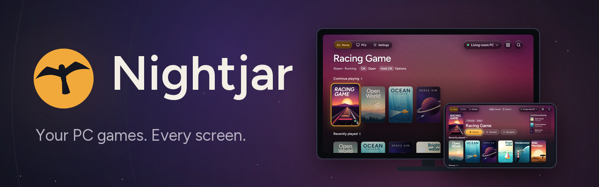

  

<h3 align="center">Every PC. Every game. Every screen.</h3>

  Stream your PC to a phone, handheld, TV or computer—engineered around a single Rust streaming engine for immediate response, Real VRR cadence, Frame Warp and true HDR. 
  Free and open source. No accounts, no ads, no tracking.

  

  
  
  

  <b>Android</b> · <b>Android TV</b> · <b>Fire TV</b> · <b>Windows</b> · <b>Linux</b> · <b>macOS by @chakib-belgaid </b> 
  Works with Sunshine, Apollo, Vibepollo, Rubylight, NVIDIA GameStream and every other Moonlight-compatible host.

**[Install](#install)** · [What you get](#what-you-get) · [Get started](#get-started-in-three-steps) · [Documentation](docs/index.md) · [Releases](https://github.com/RamazanKara/nightjar/releases) · [Website](https://ramazankara.github.io/nightjar/)

   
  <b>Nightjar with a controller:</b> Home, a game's page, the stream menu and the on-screen controls. <a href="docs/assets/readme/nightjar-tour.mp4">Watch it as a video</a>

## What you get

<table>
  <tr>
    <td width="33%" valign="top"><h4>Engineered in Rust for low latency</h4>One shared Rust streaming engine across every platform, with per-chip decoder flags, decoder receive priority and non-blocking decode hand-off. <a href="#smooth-and-it-stays-in-the-game">Latency &amp; core</a></td>
    <td width="33%" valign="top"><h4>Real VRR, Frame Warp &amp; pacing</h4>Frames pace to your game’s own rhythm under VRR, camera turns update on your screen’s next refresh, and wired desktop PyroWave races the beam. <a href="#smooth-and-it-stays-in-the-game">Smoothness</a></td>
    <td width="33%" valign="top"><h4>Stays solid on real networks</h4>Bounded adaptive bitrate, loss-aware error correction, connection recovery after dropouts and seamless network roaming keep you in the game. <a href="#smooth-and-it-stays-in-the-game">Resilience</a></td>
  </tr>
  <tr>
    <td valign="top"><h4>One library for every PC</h4>Every paired PC’s games on one Home with cover art, Continue playing, store shelves, sorting by play time or installed state, and Wake-on-LAN. <a href="#one-library-for-every-pc">The library</a></td>
    <td valign="top"><h4>At home on every screen</h4>Android phones, handhelds &amp; TVs, Windows, Linux (Desktop, KMS &amp; Steam Deck) and macOS—controller, remote, touch drag, mouse or keyboard, with Auto UI scaling. <a href="#at-home-on-every-screen">Screens</a></td>
    <td valign="top"><h4>Simple first, deep when needed</h4>Recommended defaults tuned for immediate playback, paired with per-game profiles, network-aware presets, presets search and 15 languages. <a href="#simple-first-every-setting-when-you-want-it">Settings</a></td>
  </tr>
  <tr>
    <td valign="top"><h4>The picture your screen can show</h4>H.264, HEVC, AV1 and GPU PyroWave (macOS Apple silicon included), HDR10, HDR10+, Dolby Vision, HLG, 4:4:4, FSR/SGSR/MetalFX and 7.1.4 sound. <a href="#the-picture-and-sound-your-setup-can-play">Picture and sound</a></td>
    <td valign="top"><h4>Every controller, touch and pen</h4>Up to 16 controllers, custom on-screen controls, Steam Controller pads/grips, USB DualSense haptics &amp; audio, precision touchpads and pens. <a href="#every-controller-touch-and-pen">Controls</a></td>
    <td valign="top"><h4>Tune, share &amp; play together</h4>In-stream bitrate/FPS/driver menu, Continue here, Dual screen, co-op, guests, bidirectional clipboard, files and USB forwarding. <a href="#tune-it-while-you-play">Tune &amp; share</a></td>
  </tr>
</table>

Nightjar speaks the Moonlight protocol, so it works with the host you already run, and every host gets the complete Rust engine: hardware decoding tuned per chip, HDR10, surround sound, every controller, touch, mouse and keyboard, recovery and diagnostics. It unlocks richer extensions strictly from the capabilities each PC’s host advertises, never from the host’s name.

## A closer look

### One library for every PC

Home gathers the games of every paired PC, with cover art, **Continue playing**, flexible sorting (by title, last played or play time) and grouping (including installed games apart from unowned/uninstalled entries), and a page for each game showing its store, the PC it runs on, whether it is running and the exact settings the stream will use. The glass takes the colours of the cover in focus. On a TV, each store gets its own shelf. Pick a game on a sleeping PC and Nightjar wakes the PC and starts it.

Store shelves, Steam collections and Playnite categories, play time and the richer game pages come from a Rubylight PC; with any other Moonlight host, Home shows the PC’s app list. Games from any host also launch from Android TV’s home screen, Beacon, ES-DE, Daijisho, Pegasus and the desktop command line, which takes moonlight-qt’s `stream` options too, so launchers such as MoonDeck keep working.

<table>
<tr>
<td width="50%" valign="top"> <b>Home.</b> Your games first, in the colours of the cover in focus.</td>
<td width="50%" valign="top"> <b>A page for every game.</b> Its store, the PC it runs on, whether it is running, and the exact settings the stream will use.</td>
</tr>
</table>

### At home on every screen

Every screen works with a controller or a TV remote as well as touch, mouse and keyboard. On a handheld, Home, the library and the stream menu follow the controller, with the button for each action on screen. On a phone held upright, a game's page is a sheet under its cover. Android adds picture-in-picture, rotation and foldables; the desktop app runs natively on Windows (x86-64 and ARM64), Linux, the Steam Deck in Game Mode and macOS, with the same engine and settings.

<table>
<tr>
<td width="50%" valign="top"> <b>Made for handhelds.</b> Every action has its button on screen.</td>
<td width="50%" valign="top"> <b>On the desktop too.</b> Windows, Linux and macOS, with a row per store on Home. <a href="protocol/desktop/README.md#using-nightjar">More of the desktop app</a></td>
</tr>
<tr>
<td width="50%" valign="top"> <b>Light, dark or OLED black.</b> Or whatever the system uses.</td>
<td width="50%" valign="top"> <b>Every store in one place.</b> Steam, Epic Games, GOG, EA app, Ubisoft Connect, Battle.net and Xbox, filtered with one press.</td>
</tr>
</table>

  
  &nbsp;&nbsp;
   
  <b>On a phone.</b> Home says once what the automatic settings use; a game's page is a sheet under its cover.

### Simple first, every setting when you want it

Settings open on **Recommended**: **Stream smoothness**, **Picture quality**, the screen and **HDR**, each on Auto, with **Back to recommended** to reset at any time. **Console mode** opens Nightjar straight into Home, and the desktop & TV launcher scales its text and controls to your display by default (`Auto`, or `Ctrl+0` to reset). Controls, Audio and App follow, and **More settings** unfolds the rest with search, presets and help on every row.

Phones, TVs and computers share one settings layout, and **Interface layout** (Automatic, TV or Handheld) in every Android build gives a handheld the TV screens or a TV the touch ones. Desktop users can scroll the launcher directly by dragging a touchscreen and match the launcher window to **Window** mode (`Fullscreen`, `Borderless` or `Windowed`). Settings can differ per PC and per game, with profiles that switch by network: mobile data, home Wi-Fi or other Wi-Fi. Nightjar comes in 15 languages, with high contrast, reduced motion and screen reader support.

### Smooth, and it stays in the game

Every Nightjar client runs the same Rust streaming engine (`nightjar-core`) with **Decoder priority for receiving** on by default, non-blocking decode input hand-off (a momentary decoder hiccup never stalls the receive path), and per-chip low-latency flags tuned for Snapdragon, MediaTek, Exynos, Tensor, Tegra and Amlogic decoders. Frames are paced to your display's refresh rate, hosts that support phase lock receive latch reports so frames arrive right before scanout, and the desktop client can [beam race](docs/beam-racing.md) PyroWave frames as slices arrive.

- **Stays in the game.** The bitrate adapts automatically when the network is busy, following loss, round-trip variation and decode headroom, while error correction scales to measured loss with supporting hosts. An interrupted stream recovers into the running game, holds through up to a minute of network silence, and follows your phone across network changes on a Rubylight PC.
- **Real VRR,** on by default with Variable refresh rate: on a G-Sync, FreeSync, HDMI VRR or Android adaptive screen, frames land on the game's own rhythm instead of the network's. Fixed high-refresh screens can hold an even cadence with Fractional V-Sync. [How it works](docs/real-vrr.md)
- **Frame Warp,** with a Rubylight PC: a mouse or right-stick camera turn shows on your screen's next refresh while the game's HUD stays locked in place. [How it works](docs/protocol/frame-warp.md)

### The picture and sound your setup can play

H.264, HEVC and AV1 on the hardware decoder, and GPU-accelerated PyroWave decoded on the GPU—including on Apple silicon Macs through KosmicKrisp and across Linux via VA-API, Vulkan Video, V4L2 M2M (including Steam Deck & ARM handhelds) or NVDEC. HDR10 works with any HDR-capable host; HDR10+, HLG and Dolby Vision light up where the PC, decoder and display support them, and on Linux Nightjar can render straight to DRM/KMS without a desktop session. Sharper colored text (4:4:4) checks hardware support up front before starting. Upscaling uses AMD FSR 1 or Snapdragon GSR on Android, MetalFX on macOS, or GPU video enhancement on Windows.

Sound comes in stereo, 5.1, 7.1 and 7.1.4, or as PCM, Dolby Digital or Dolby Digital Plus passed through to a receiver, soundbar or TV. The microphone has echo cancellation on every platform, plus noise suppression, gain and one-tap mute on Android.

### Every controller, touch and pen

Up to 16 controllers, with mapping per model. Sunshine-based PCs add DualSense adaptive triggers, motion and touchpads, and on Android Nightjar's own USB drivers handle the DualSense's lightbar and haptics, Xbox and Switch Pro controllers. Touch works as a trackpad, directly, as multi-touch or with a local cursor, with pinch zoom, and pens send pressure and tilt; a laptop's touchpad gives the PC its own touchpad gestures on PCs that take them.

- **On-screen controls you lay out yourself.** Classic and Modern styles with an editor inside the stream, Xbox, PlayStation or Nintendo glyphs, presets, a layout for each orientation, and a pointer touchpad that moves the mouse or the camera. They hide while a controller is connected, and can be a player of their own.
- **A real PC keyboard.** Esc, F1 to F12, arrows and sticky modifiers, by touch, controller or TV remote, and a soft keyboard that opens when a text field on the PC takes focus.
- **Your own hotkeys.** Every stream hotkey can be changed or turned off, your keyboard shortcuts become stream-menu tiles, and controller chords open the menu.
- **Input-only.** An **Input-only** stream sends controls and feedback without the video, to any PC.

<table>
<tr>
<td width="50%" valign="top"> <b>On-screen controls.</b> Sticks, D-pad, buttons and triggers where you put them.</td>
<td width="50%" valign="top"> <b>The PC keyboard.</b> Every key of a desktop keyboard, by touch or controller.</td>
</tr>
</table>

### Tune it while you play

The stream menu changes the bitrate and frame rate during a stream, with hosts that accept it. With a Rubylight PC it does much more: the PC's Radeon or NVIDIA graphics settings, a game's frame generation on the PC, **Continue here** to move a running game to the device in your hands, **Stream here too**, a second screen for dual-screen devices, **Microphone only**, and the PC's power and update controls.

With Apollo, Vibepollo and Rubylight, clipboard text travels to the PC. With a Rubylight PC, the clipboard syncs both ways, with images, and files, the PC's shared folders and USB devices plugged into your device reach the PC.

A performance overlay in three levels of detail shows the network and decoding, and the PC's CPU and GPU readings from a host that sends them. A [stream health](docs/stream-health.md) report explains stutter in plain words, and an input latency test, a decoder benchmark that runs without a PC, frame timings as CSV, a network speed test and redacted problem reports help find the rest.

<table>
<tr>
<td width="50%" valign="top"> <b>The stream menu.</b> Keyboard, touch mode, clipboard and the bitrate, with Disconnect and Quit game.</td>
<td width="50%" valign="top"> <b>Know why a stream stuttered.</b> The overlay, from one line to every stage.</td>
</tr>
</table>

### Play together, and away from home

- **Join as a guest.** On a PC that offers guests, **Join** on a game another device plays asks that device to let you in: the same picture and sound, your own controller, and the keyboard and mouse only if the player grants them.
- **Invite a friend over the internet.** **Guests** in the stream menu makes a one-time link, `rubylight://invite`, for one friend. Their Nightjar opens it, or takes it pasted under **Add PC**, and joins as a guest without a PIN or port forwarding once you let them in.
- **Take a co-op seat.** Take a free player slot in a PC's split-screen co-op session, or return to your own.
- **Play away from home.** **Play away from home** in a PC's settings walks you through connecting this device and the PC over a private VPN such as Tailscale, then tests the PC from where you are. Nightjar also tries the PC's IPv6 address and a forwarded port, and with a Rubylight PC that offers it, a direct path both sides punch through their routers, without port forwarding. [Play away from home](docs/remote-setup.md)

### Private by design

No accounts, advertising or analytics, and nothing sent to its developers. Video, audio, input, clipboard and files travel only between your device and your PC. Licensed under the GPL-3.0 and developed in the open.

The pictures and the film on this page use Nightjar's offline demo with a sample library and an original test animation; the readings shown in them are scripted, not measured.

The [feature overview](docs/features.md) lists everything, with a link to each guide, and [each release](https://github.com/RamazanKara/nightjar/releases) says what changed.

## What players are saying

<table width="100%">
  <tr>
    <td width="50%" align="center" valign="top">
<em>“The inclusion of support for high polling mice and keyboard, the smoothness of the VRR, the reduced latency overall; I'm absolutely floored by how good it's turned out!”</em>

<strong>— /u/flyingk</strong>
</td>
    <td width="50%" align="center" valign="top">
<em>“Nightjar is currently my favourite Android client. I really love its modern, clean UI. It feels great to use!”</em>

<strong>— daniel7277</strong>
</td>
  </tr>
  <tr>
    <td width="50%" align="center" valign="top">
<em>“The integrated library, session controls, and host-aware options make it feel like a complete console experience.”</em>

<strong>— tylerlane</strong>
</td>
    <td width="50%" align="center" valign="top">
<em>“thank you for creating such a beautiful, clean Android client.”</em>

<strong>— rishisinghawadhiya</strong>
</td>
  </tr>
  <tr>
    <td width="50%" align="center" valign="top">
<em>“I really like your modern on-screen controller design.”</em>

<strong>— magicwand9099</strong>
</td>
    <td width="50%" align="center" valign="top">
<em>“the vrr works wonders”</em>

<strong>— u/Potential_Sorbet1809</strong>
</td>
  </tr>
</table>

<strong>More feedback from players</strong>

- *“Played for about 30 minutes, worked great, no issues.”* — **elkinjosetm**
- *“I believe Nightjar is currently the superior client for Android.”* — **jun182**
- *“It looks absolutely beautiful”* — **daniel7277**
- *“feels absolutely amazing! It's so satisfying.”* — **daniel7277**
- *“I love nightjar”* — **ASE236-lang**
- *“the telemetry/export tools make this kind of investigation much easier.”* — **VirtualGIT20**
- *“its working perfectly right now.”* — **leonardo7999-byte**
- *“I have been using nightjar and reporting issues to the developer! It has been great!”* — **u/ssjucrono**
- *“much more plug and play and easier to understand.”* — **u/wolf0x**

## Install

Download from the [latest release](https://github.com/RamazanKara/nightjar/releases/latest). Every release publishes the SHA-256 of each file in `SHA256SUMS-<version>.txt`.

| Platform | Package | How to install |
| --- | --- | --- |
| Android phones, tablets and handhelds | [`nightjar.apk`](https://github.com/RamazanKara/nightjar/releases/latest/download/nightjar.apk) | Open the APK and allow installation from the app that opened it. To receive updates through [Obtainium](https://github.com/ImranR98/Obtainium), add `https://github.com/RamazanKara/nightjar`. |
| Android TV and Fire TV | The same APK | Install AFTVnews' [Downloader](https://www.aftvnews.com/downloader/) from the TV's app store, enter the code **`3815143`** and install the APK it downloads. The code always points to the latest release. |
| macOS 13 or later | `nightjar-desktop-<version>-macos-arm64.zip` (Apple Silicon), `…-macos-x86_64.zip` (Intel) | Unpack it, move `Nightjar.app` to Applications and [allow it to open](protocol/desktop/README.md#install) on first start. |
| Windows 10 and 11 | `nightjar-desktop-<version>-windows-x86_64-setup.exe`, or `…-windows-arm64-setup.exe` on ARM64 PCs such as Snapdragon X laptops | Run the installer. It installs for the current user without administrator rights and updates in place, keeping settings and paired PCs. The `.zip` contains the same files and runs without installation. |
| Debian, Ubuntu | `nightjar-desktop-<version>-linux-x86_64.deb` | `sudo apt install ./nightjar-desktop-<version>-linux-x86_64.deb` |
| Fedora | `nightjar-desktop-<version>-linux-x86_64.rpm` | `sudo dnf install ./nightjar-desktop-<version>-linux-x86_64.rpm` |
| Other Linux distributions | `.AppImage` or `.tar.gz` | Make the AppImage executable and run it, or unpack the archive and run `./nightjar`. |
| Steam Deck and other Linux handhelds | `nightjar-desktop-<version>-x86_64.flatpak` | Install it with `flatpak install --user`; [Steam Deck](docs/steam-deck.md) covers Game Mode and HDR. |
| Linux on ARM handhelds and boards | The same packages and the Flatpak, with `aarch64` in the name | As above. |

Release APKs are signed with the Nightjar release key (certificate SHA-256 `312ed322c7c29d1aec4fae4a3979ebcb557af44d821d7f4746c0968548eb630b`), so every later release installs over the previous one. Outside Google Play, the Android app checks GitHub for new releases and asks before installing one. The Windows installer and the AppImage check once per launch and update with one click, keeping settings and paired PCs; a portable Windows copy links to the release page.

Nightjar has its own application ID and pairs separately, so it installs beside other Moonlight clients without affecting them. [Installing the desktop client](protocol/desktop/README.md#installing) covers removal, signing and the location of settings.

> [!NOTE]
> ### Testers wanted: help bring Nightjar to Google Play
>
> Nightjar is getting ready for Google Play, and Google asks for one thing first: at least 12 testers who keep the app for 14 days. If you stream to an Android phone, tablet, handheld or TV, you can be one of them, see each new build before anyone else and help put Nightjar in the store.
>
> - **What you need:** an Android device with the Play Store and a PC running a Moonlight-compatible host.
> - **What you do:** keep Nightjar installed for 14 days, play the way you always do, and tell us what breaks in [issues](https://github.com/RamazanKara/nightjar/issues).
> - **What it costs:** nothing. Testers get a free code for Nightjar on Google Play. If Google Play charges you anyway, you get the full amount back.
> - **How to join:** email [ramazan.kara.fo@gmail.com](mailto:ramazan.kara.fo@gmail.com?subject=Nightjar%20tester) with the subject "Nightjar tester" and the Google account you use on Google Play. You get the invite link and your code by email.
>
> The download here on GitHub stays free and gets the same updates.

## Get started in three steps

1. **Set up the PC.** Install a Moonlight-compatible host on it, such as [Sunshine](https://github.com/LizardByte/Sunshine), [Apollo](https://github.com/ClassicOldSong/Apollo), [Vibepollo](https://github.com/Nonary/Vibepollo) or [Rubylight](https://github.com/RamazanKara/Rubylight).
2. **Pair.** Open Nightjar on the same network. It lists the PCs it finds; otherwise choose **Add PC** and enter the PC's address. Select the PC and enter the PIN that Nightjar shows in the host's web UI, or with a Rubylight PC choose **Scan QR code** and scan the code its console shows. If the host grants permissions per device, allow this device to list, view and launch apps, and the input types you use.
3. **Play.** Pick a game.

The [quick start](docs/quick-start.md) and [pairing guide](docs/pairing.md) cover each step, including one-time PINs and Wake-on-LAN. To play outside your home network, see [Play away from home](docs/remote-setup.md).

## Host compatibility

Discovery, PIN pairing, Wake-on-LAN, the app library, H.264, HEVC and AV1, HDR10, surround sound, all input types, stream recovery and diagnostics work with every Moonlight-compatible host. Further features depend on what the host reports:

| Host capability | Provided by | What Nightjar adds |
| --- | --- | --- |
| Sunshine protocol extensions | Sunshine and hosts built on it | DualSense adaptive triggers and lightbar, controller motion and touchpads, native touch and pen |
| Device permissions and virtual displays | Apollo, Vibepollo, Rubylight | One-time PIN pairing, per-device permissions, a virtual display at the device's resolution, fractional refresh rates, clipboard transfer and server commands |
| Rubylight native API and stream extensions | [Rubylight](https://ramazankara.github.io/Rubylight/) 3.0 and later | Home with games from every store, the Session and graphics menu with Radeon settings, QR pairing, clipboard sync, files, shared folders and USB forwarding, co-op sessions, HDR10+, HLG and Dolby Vision, 7.1.4 and audio passthrough, bitrate and frame-rate changes during a stream, host hardware readings |

The **Error correction** setting and host-side automatic bitrate also work with Sunshine-based PCs that support them, and PyroWave works with any host that offers it. When a PC's host lacks a feature, Nightjar hides it or names the host setting or permission it requires. [Host feature support](docs/PARITY-MATRIX.md) lists every capability and the hosts known to provide it.

## Requirements

| Platform | Requirement |
| --- | --- |
| Android, Android TV, Fire TV | Android 7.1 or newer. PyroWave needs 64-bit Android 10 or newer with Vulkan 1.1. Audio passthrough needs Android 10 or newer; 7.1.4 needs Android 12L or newer and a 12-channel output. |
| macOS | macOS 13 or later, on Apple Silicon or Intel. |
| Windows | Windows 10 or 11, x86-64 or ARM64 (a native build for each). HDR needs an HDR display with HDR turned on in Windows. PyroWave GPU decoding needs Vulkan 1.3. |
| Linux | x86-64 with glibc 2.35 or newer: Ubuntu 22.04, Debian 12, Fedora 36 or later; aarch64 packages for ARM handhelds and boards. Hardware decoding through VA-API, Vulkan video, V4L2 M2M or NVDEC. |
| PC | A Moonlight-compatible host. The host's own requirements apply. |

Use the built-in decoder benchmark to measure your own device; community-submitted results live in [device results](docs/devices.md#devices).

## Documentation

The [documentation index](docs/index.md) lists every page. The most used:

| Topic | Pages |
| --- | --- |
| Setup | [Quick start](docs/quick-start.md), [pairing and permissions](docs/pairing.md), [play away from home](docs/remote-setup.md) |
| Daily use | [Home and the session menu](docs/console.md), [controls](docs/controls.md), [clipboard, files and USB devices](docs/sharing.md) |
| Tuning | [Video and latency](docs/video-and-latency.md), [recovery and automatic quality](docs/recovery-and-quality.md), [settings reference](docs/settings.md) |
| Problems | [Troubleshooting](docs/TROUBLESHOOTING.md), [stream health](docs/stream-health.md), [FAQ](docs/faq.md) |
| Desktop | [Nightjar for macOS, Windows and Linux](protocol/desktop/README.md), [Android and desktop compared](docs/CLIENT-PARITY.md) |

## Building from source

The [macOS guide](protocol/desktop/README.md#macos) covers installing the release download, running the Rust client and packaging Nightjar.app yourself.

The Android app builds with Gradle and JDK 21; its native code needs the Android NDK and Rust. The streaming engine and the desktop client are a Cargo workspace under [`protocol/`](protocol), shared by both apps.

- [Building Nightjar](docs/building.md): toolchains, tests, signing, the release workflow and the documentation checks.
- [Building the desktop client](protocol/desktop/README.md#building): Windows and Linux builds and packaging.

## Contributing

Report bugs and request features in the [issue tracker](https://github.com/RamazanKara/nightjar/issues/new/choose). [Device results](docs/devices.md) explains how to submit your device's benchmark, and [translations](docs/TRANSLATIONS.md#help-translate) explains how to correct or add a language. Nightjar ships in 15 languages on Android, Windows, Linux and macOS.

## Privacy

Video, audio, input, clipboard contents and files travel only between your device and your PC. Nightjar contacts GitHub to check for updates (the Google Play build updates through Play instead) and Moonlight's STUN server (`stun.moonlight-stream.org`) to learn the network's public address, so it can tell whether the PC is reachable from outside. On Android it also uses Moonlight's connection-test server (`android.conntest.moonlight-stream.org`) to diagnose connection failures. Problem reports stay on the device until you share them. The [privacy policy](docs/PRIVACY.md) has the details.

## License and credits

Nightjar is licensed under the [GNU General Public License v3.0](LICENSE.txt). Everyone who helped, with their GitHub names, is in [CONTRIBUTORS.md](CONTRIBUTORS.md).

Nightjar is a fork of [Moonlight Android](https://github.com/moonlight-stream/moonlight-android) by Cameron Gutman, Diego Waxemberg, Aaron Neyer, Andrew Hennessy and contributors, and was previously published as Butterpollo and as Rubylight Android ([rename history](docs/RENAME.md)). It incorporates work from these GPL-3.0 projects:

- [moonlight-common-c](https://github.com/moonlight-stream/moonlight-common-c), the protocol library Nightjar's Rust engine was ported from and the project Nightjar began as, and [moonlight-qt](https://github.com/moonlight-stream/moonlight-qt) by Cameron Gutman and contributors, for the desktop client's keyboard and controller tables, decoder setup, default bitrate curve, drawing straight to the display through DRM/KMS on Linux and the display's native resolution on macOS, and Moonlight's FFmpeg patch for HEVC 4:4:4 hardware decoding on Windows ([moonlight-qt-deps](https://github.com/moonlight-stream/moonlight-qt-deps))
- [Artemis Android](https://github.com/ClassicOldSong/moonlight-android) by ClassicOldSong, for Apollo extension behavior, decoder setup and the touchpad gestures (tap to click, two-finger scroll, tap-and-drag), which Umberto Marotta ported
- [Moonlight V+](https://github.com/qiin2333/moonlight-vplus) by qiin2333, for soft-keyboard, decoder and controller handling and the GL renderer probe, and [Moonlight V+ PC](https://github.com/qiin2333/moonlight-qt), for the desktop client's D3D11 draw pass, AI enhancement, touchpad input, Linux USB forwarding, crash dumps and update check
- [Moonlight X](https://github.com/MoreOrLessSoftware/moonlight-android/tree/mlsoft-x) by MoreOrLessSoftware, for Exynos and Tensor decoder settings and the Vulkan renderer
- [jvanderv42's Nightjar fork](https://github.com/jvanderv42/nightjar), for the per-controller gyroscope mapping (axes, inversion, sensitivity and the Flydigi preset) and the in-stream motion readings
- [moonlight-noir](https://github.com/derflacco/moonlight-android) by derflacco, for decoder low-latency settings
- Nonary's moonlight-qt fork, the reference for the desktop client's VRR pacing and D3D11VA rendering, and the source of the Linux high-performance GPU power hold (`client/protocol/desktop-media/src/stream/gpu_hold.rs`), the Windows VRR sync switch `blank` (`stream/present/{pacer,vrr}.rs` and `stream/render/pacing.rs`) and the macOS refresh range (`client/protocol/desktop-media/src/mac_display.rs`), all from commit 19758e5e6
- [Nonary/moonlight-common-c](https://github.com/Nonary/moonlight-common-c), for the DualSense waveform protocol and the controller speaker PCM format, and Nonary's moonlight-qt fork by Chase Payne at commit b72d0c2, for the DualSense speaker over Bluetooth (`client/protocol/desktop-media/src/dualsense_bt_audio.rs`), built on mrFunkill's [decky-dualsense-wired](https://github.com/mrFunkill/decky-dualsense-wired) research

The bundled third-party components (PyroWave, Granite, volk, KosmicKrisp from Mesa, the Khronos Vulkan loader, SPIRV-Tools, SPIRV-Headers, libadrenotools, AMD FSR 1, Qualcomm SGSR 1, SDL, FFmpeg, the Figtree font and others) keep their own licenses. [License and credits](docs/index.md#license-and-credits) names each contribution and the notices to retain when redistributing.

Thank you to everyone who opened pull requests, reported bugs, requested features and tested builds; you are all in [CONTRIBUTORS.md](CONTRIBUTORS.md).
